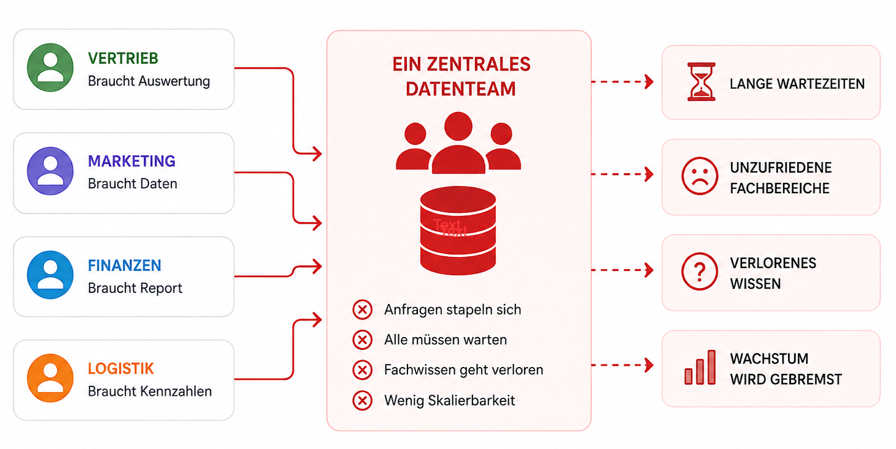
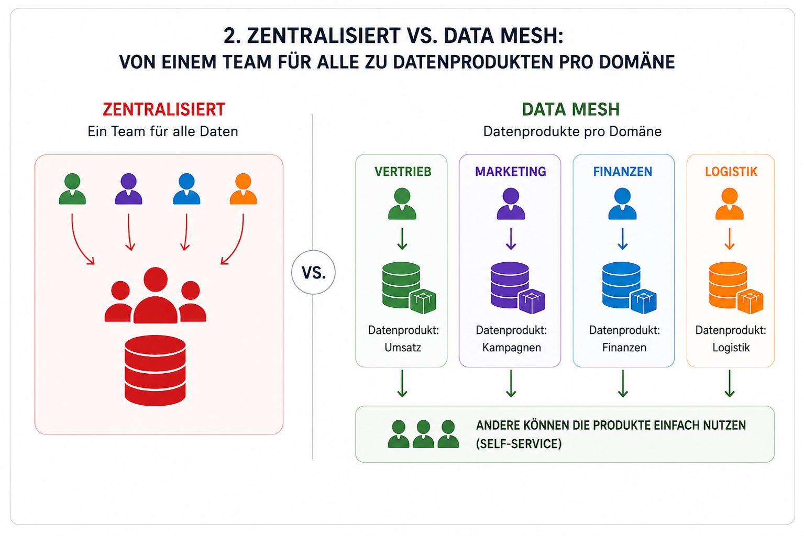
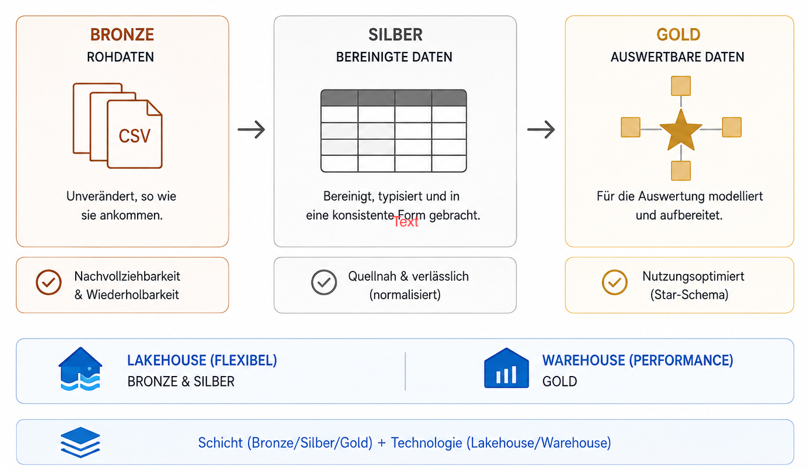
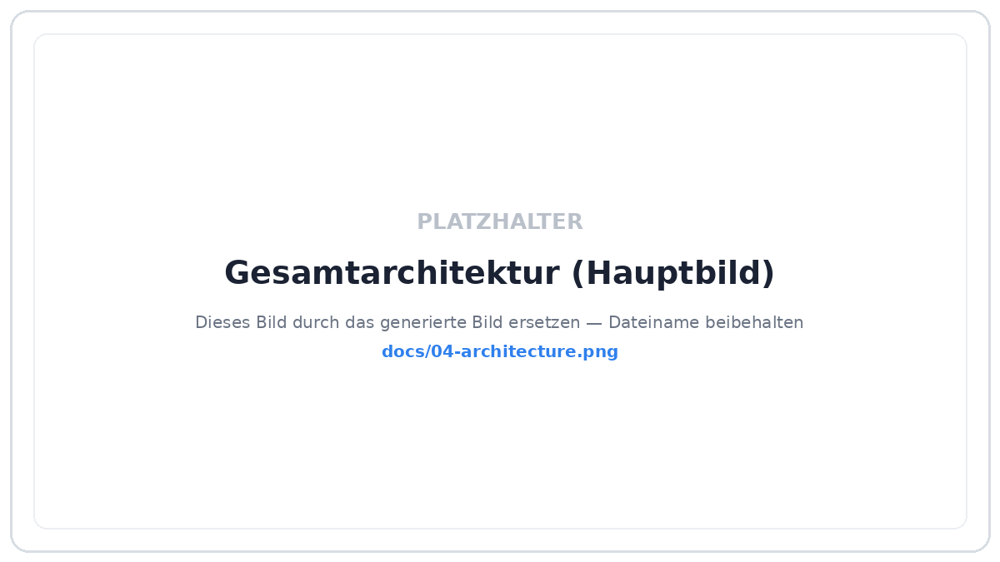
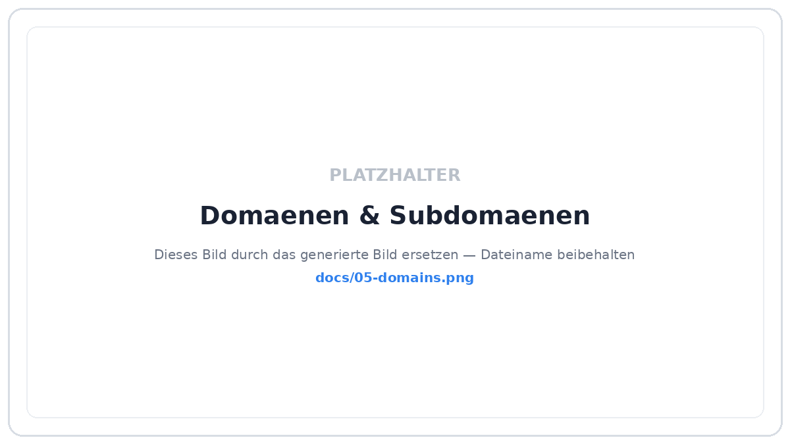
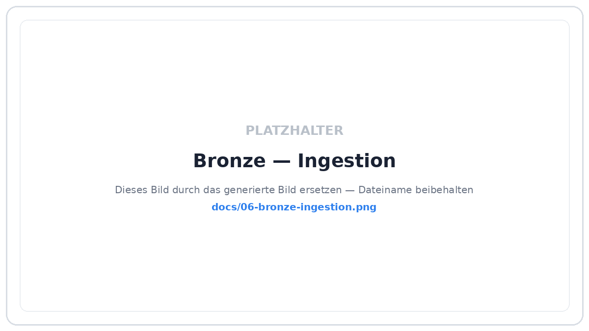
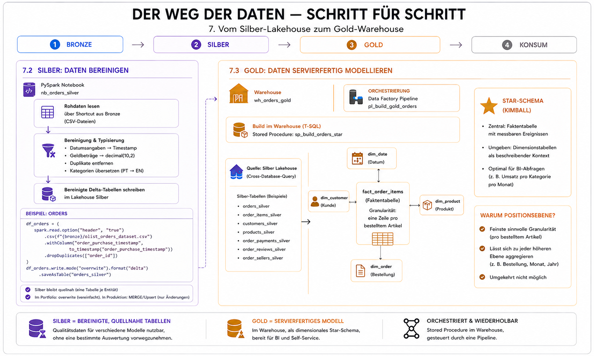
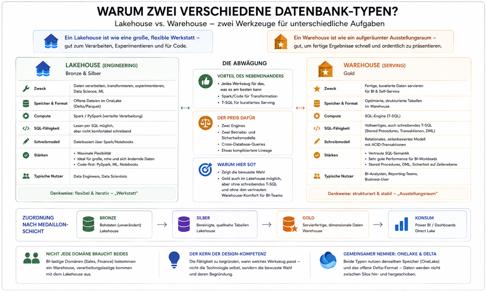
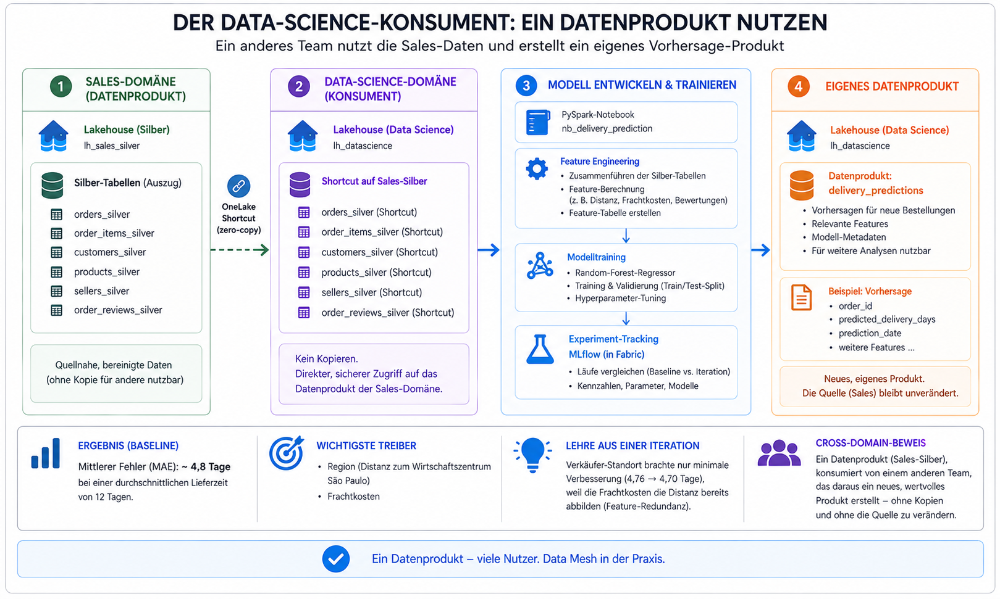

# fabric-ecommerce-datamesh

**Eine moderne Datenplattform auf Microsoft Fabric — gebaut wie ein echtes Unternehmen sie bauen würde.**

Dieses Projekt nimmt öffentliche E-Commerce-Daten und verwandelt sie Schritt für Schritt in aufbereitete Kennzahlen, Dashboards und ein Machine-Learning-Modell — organisiert nach den Prinzipien **Data Mesh** und **Medaillon-Architektur**. Es ist ein Portfolio-Projekt, das zeigen soll, *wie* man Datenplattformen strukturiert und *warum* man bestimmte Entscheidungen trifft.

> 📖 **Wie man dieses README liest:** Jeder Abschnitt beginnt einfach und für alle verständlich und wird dann Stück für Stück technischer. Wer nur einen Überblick will, liest die ersten Absätze jedes Abschnitts. Wer tiefer einsteigen möchte, findet darunter Details, Code und Design-Entscheidungen.

---

<!--
════════════════════════════════════════════════════════════════════
BILDANWEISUNGEN — Hinweis für die Bilderstellung:
Alle Bilder sollen im gleichen Stil sein: flache Vektor-Infografik,
weißer Hintergrund, "Azure-Architektur-Dokumentations-Stil",
dünne farbige Pfeile mit Pfeilspitzen, abgerundete gestrichelte
Container, gut lesbare serifenlose Beschriftungen, KEINE echten
Firmen-Logos. Farbwelt: Blau (#2F80ED) für Datenflüsse, Bronze/Kupfer,
Silber/Grau und Gold/Gelb für die drei Datenschichten, dezente
Pastell-Container. Immer 16:9, viel Weißraum, professionell und clean.
Die konkreten Bildanweisungen stehen jeweils in den Blöcken "🎨 Bild".
════════════════════════════════════════════════════════════════════
-->

## 1. Das Problem: Warum überhaupt eine besondere Architektur?

**Ganz einfach gesagt:** In vielen Unternehmen gibt es *ein* zentrales Datenteam. Jede Abteilung — Vertrieb, Marketing, Finanzen, Logistik — muss bei diesem einen Team anfragen, wenn sie eine Auswertung, ein Dashboard oder einen neuen Datensatz braucht. Das Team wird zum **Flaschenhals**: Anfragen stapeln sich, alle warten, und die Abteilungen, die ihre eigenen Daten am besten kennen, dürfen nicht selbst ran.



**Etwas technischer:** Dieser zentralistische Ansatz skaliert schlecht. Das zentrale Team versteht die Fachlichkeit einzelner Bereiche nie so gut wie die Bereiche selbst, Wissen geht in der Übergabe verloren, und mit jeder neuen Abteilung wächst der Rückstau. Genau hier setzt **Data Mesh** an.

---

## 2. Was ist Data Mesh?

**Ganz einfach gesagt:** Statt einer zentralen Datenküche, die für alle kocht, bekommt **jede Abteilung ihre eigene kleine Küche** — betreibt sie aber nach gemeinsamen Standards. Jede Abteilung ist für ihre eigenen Daten verantwortlich und stellt sie den anderen als fertiges, verlässliches **„Datenprodukt"** zur Verfügung — so wie ein Team im Supermarkt ein fertig verpacktes Produkt ins Regal stellt, das andere einfach nehmen können.



> 🎨 **Bild 02 — `docs/02-centralized-vs-mesh.png`**
> Flache Vektor-Infografik, weißer Hintergrund, drei übereinander gestapelte Vergleichsblöcke mit fetten Überschriften.
> Block 1, Überschrift „Zentralisiert": links ein einzelnes Team-Icon „Zentrales Datenteam", daneben eine einzelne horizontale Pipeline aus kleinen Boxen (Datenquelle → Bronze → Silber → Gold → Dashboard → Power-BI-Symbol), verbunden mit blauen Pfeilen. Alles in einem gestrichelten Container.
> Block 2, Überschrift „Data Mesh": zwei übereinanderliegende, farblich getrennte Zeilen (Lanes), je mit eigenem Team-Icon links („Sales Domain Team", „Finance Domain Team") und je einer EIGENEN kompletten Pipeline (Quelle → Bronze → Silber → Gold → Dashboard → Power BI). Zeigt: jede Domäne hat ihre eigene Strecke.
> Block 3, Überschrift „Mein hybrider Ansatz": oben ein gemeinsamer Plattform-Block „Zentrale Ingestion (Bronze)", von dem gestrichelte Pfeile nach unten in mehrere Domänen-Lanes gehen, die dann jeweils Silber → Gold → Power BI machen.
> Stil: klar, plakativ, gut lesbare Labels, blaue Pfeile, dezente Farbcontainer.

**Etwas technischer:** Data Mesh beruht auf vier Prinzipien: (1) **Domain Ownership** — fachliche Bereiche besitzen ihre Daten; (2) **Data as a Product** — Daten werden wie ein Produkt gepflegt und bereitgestellt; (3) **Self-Serve-Plattform** — eine gemeinsame technische Basis, auf der alle bauen; (4) **föderierte Governance** — gemeinsame Regeln, aber dezentrale Umsetzung.

**Für Fortgeschrittene:** In Microsoft Fabric bilde ich diese Prinzipien konkret ab über **Fabric Domains** (fachliche Gruppierung), **einen Workspace pro Subdomäne** (Ownership-Grenze) und **OneLake Shortcuts** (Datenprodukte werden ohne Kopie geteilt — „zero-copy"). Die Self-Serve-Plattform ist Fabric selbst; die Governance regeln später Zugriffsrollen. Wichtig: Ich baue bewusst einen **hybriden** Ansatz — eine geteilte zentrale Ingestion für Rohdaten, aber domänen-eigene Verarbeitung. Das vermeidet, dass jede Domäne dieselbe Quelle mehrfach lädt, und hält trotzdem das Ownership dort, wo es zählt.

---

## 3. Die Medaillon-Architektur: Bronze, Silber, Gold

**Ganz einfach gesagt:** Rohdaten sind wie frisch eingekaufte Zutaten — man kann sie nicht direkt servieren. Deshalb durchlaufen die Daten drei Stufen, wie in einer Küche:

- 🥉 **Bronze** = die rohen Zutaten, so wie sie ankommen (unverändert, ungewaschen).
- 🥈 **Silber** = gewaschen, geschnitten, sortiert (bereinigt und in eine saubere Form gebracht).
- 🥇 **Gold** = das fertige Gericht, angerichtet und servierfertig (aufbereitet für Auswertungen und Dashboards).



> 🎨 **Bild 03 — `docs/03-medallion.png`**
> Flache Vektor-Infografik, weißer Hintergrund, horizontaler Ablauf von links nach rechts mit drei großen glänzenden Datenbank-Zylindern, verbunden durch dicke blaue Pfeile.
> Zylinder 1 in Kupfer-Bronze-Farbe, Label „BRONZE — Rohdaten (wie geliefert)". Zylinder 2 in Silber-Grau, Label „SILBER — bereinigt & typisiert". Zylinder 3 in Gold-Gelb, Label „GOLD — servierfertig für BI".
> Optional über jedem Zylinder ein kleines dezentes Symbol als Analogie: rohe Zutaten / geschnittenes Gemüse / fertiger Teller. Titel oben: „Medaillon-Architektur". Sauber, plakativ, viel Weißraum.

**Etwas technischer:** Die drei Schichten trennen Verantwortlichkeiten. Bronze bewahrt die Rohdaten unverändert (Nachvollziehbarkeit, Wiederholbarkeit). Silber enthält bereinigte, typisierte Tabellen — eine pro Quell-Entität, quellnah, aber verlässlich. Gold ist für die Nutzung modelliert, typischerweise als dimensionales Modell für Business Intelligence.

**Für Fortgeschrittene:** Wichtig ist, dass „Schicht" (Bronze/Silber/Gold) und „Technologie" (Lakehouse/Warehouse) zwei verschiedene Dinge sind. In diesem Projekt liegen Bronze und Silber im **Lakehouse** (flexibel, für Code/Spark), Gold im **Warehouse** (T-SQL, dimensional). Die Normalisierungs-Richtung dreht sich dabei bewusst um: Silber ist quellnah/normalisiert, Gold ist denormalisiert als Star-Schema — optimiert für schnelle Abfragen im Dashboard.

---

## 4. Was wurde hier konkret gebaut? — Der Gesamtüberblick

**Ganz einfach gesagt:** Öffentliche Verkaufsdaten eines brasilianischen Online-Marktplatzes wandern von einer Datei-Ablage in der Cloud durch die drei Küchen-Stufen und enden in einem Dashboard und einem Vorhersage-Modell. Alles ist so organisiert, dass verschiedene „Abteilungen" ihre eigenen Bereiche besitzen.



> 🎨 **Bild 04 — `docs/04-architecture.png`** (Haupt-Architekturbild, das wichtigste)
> Flache Vektor-Infografik im Azure-Architektur-Stil, weißer Hintergrund, horizontaler Fluss links → rechts, gestrichelte abgerundete Umgebungs-Container, glänzende Datenbank-Zylinder, dünne blaue Pfeile mit Beschriftungen.
> Ganz links: kleine Box „Kaggle — Olist CSV-Dateien".
> Blauer Pfeil in einen gestrichelten blauen Container „Microsoft Azure", der EINEN teal-farbenen Zylinder „ADLS Gen2 — Container bronze" enthält.
> Blauer Pfeil mit Label „Data Factory Copy" führt in einen großen gestrichelten teal-grünen Container „Microsoft Fabric — via GitHub versioniert".
> Im Fabric-Container drei Zylinder in einer Reihe, verbunden mit blauen Pfeilen: Bronze-Zylinder „lh_bronze", Silber-Zylinder „lh_orders_silver", Gold-Zylinder „wh_orders_gold". Darunter kleine Klammern mit „ws-platform-ingestion" (unter Bronze) und „ws-sales-orders" (unter Silber+Gold).
> Vom Gold-Zylinder ein blauer Pfeil mit Label „Semantic Model / Direct Lake" zu einem kleinen Balkendiagramm-Symbol „Power BI".
> Vom Silber-Zylinder ein GESTRICHELTER grauer Pfeil mit Label „OneLake Shortcut" nach unten zu einer gestrichelten gelb-orangenen Box „Data Science — ws-datascience (Machine Learning)".
> Kleine Legende unten: durchgezogener blauer Pfeil = Datenfluss, gestrichelter Pfeil = Shortcut (zero-copy). Titel oben: „E-Commerce Data Platform — Medaillon + Data Mesh".

**Etwas technischer:** Die Quelle liegt in **Azure Data Lake Storage Gen2** (nur die Rohdateien). Die Verarbeitung passiert komplett in **Microsoft Fabric** und ist über **GitHub** versioniert. Eine zentrale Plattform-Ebene übernimmt die Ingestion (Bronze); jede Fachdomäne baut daraus ihre Silber- und Gold-Produkte. Eine consumer-orientierte Data-Science-Domäne greift per Shortcut auf die Produkte zu.

**Für Fortgeschrittene:** Das Bewusste an diesem Design: Azure umschließt nur den Storage (die Rohdaten), nicht die ganze Plattform — die Grenze zwischen Azure-Storage und Fabric ist die Stelle, an der die Ingestion-Pipeline die Systemgrenze überquert. Git rahmt alles ab der Ingestion ein, weil genau dieser Teil versioniert wird. Rohdaten in Azure gehen bewusst nicht ins Git.

---

## 5. Die Datenquelle

**Ganz einfach gesagt:** Echte (anonymisierte) Bestelldaten eines großen brasilianischen Online-Marktplatzes namens Olist — rund 100.000 Bestellungen mit Kunden, Produkten, Zahlungen, Bewertungen und Lieferzeiten.

**Etwas technischer:** Der [Brazilian E-Commerce Public Dataset by Olist](https://www.kaggle.com/datasets/olistbr/brazilian-ecommerce) besteht aus neun CSV-Dateien, die über gemeinsame Schlüssel verknüpft sind (orders, order_items, customers, products, sellers, payments, reviews, geolocation, Kategorie-Übersetzung). Die relationale Struktur macht ihn ideal, um mehrere Domänen und ein echtes Star-Schema zu bauen.

---

## 6. Die Domänen — wer besitzt was

**Ganz einfach gesagt:** Die Plattform ist in fachliche Bereiche aufgeteilt, so wie ein Unternehmen Abteilungen hat. Jeder Bereich („Domäne") hat Unterbereiche („Subdomänen"), und jeder Unterbereich hat seinen eigenen Arbeitsraum.



> 🎨 **Bild 05 — `docs/05-domains.png`**
> Flache Vektor-Infografik, weißer Hintergrund, Baum-/Hierarchie-Darstellung von oben nach unten.
> Oberste Ebene: „Fabric Tenant". Darunter verzweigt es zu einem Plattform-Knoten „Plattform — ws-platform-ingestion" (blau hervorgehoben) und zu fünf Domänen-Knoten: „Sales", „Finance", „Supply Chain", „Marketing & CX", „Data Science (Consumer)".
> Unter jeder der vier Fach-Domänen zwei kleinere Kästchen (Subdomänen mit Workspace-Namen), z. B. Sales → „ws-sales-orders (Order Management)" und „ws-sales-catalog (Product & Catalog)"; Finance → „ws-finance-payments", „ws-finance-revenue"; Supply Chain → „ws-supply-delivery", „ws-supply-sellers"; Marketing & CX → „ws-mktg-customer", „ws-mktg-reviews". Data Science → „ws-datascience".
> Farbcodierung: der Sales-Order-Management-Knoten grün markiert („gebaut"), die Plattform blau, Data Science gelb-orange, der Rest neutral-grau („geplant"). Kleine Legende dazu. Titel oben: „Data Mesh — Domänen & Subdomänen".

**Etwas technischer:** Vier *source-aligned* Domänen (die Daten erzeugen) und eine *consumer-aligned* Domäne (Data Science, die Daten nutzt). Umgesetzt als **Fabric Domains** im Admin-Portal; jede Subdomäne ist ein eigener Workspace. Die Plattform-Ingestion gehört bewusst *keiner* Fachdomäne — sie ist geteilte Infrastruktur.

| Domäne | Subdomäne | Workspace |
|---|---|---|
| **Sales** | Order Management · Product & Catalog | `ws-sales-orders` · `ws-sales-catalog` |
| **Finance** | Payments · Revenue & Freight | `ws-finance-payments` · `ws-finance-revenue` |
| **Supply Chain** | Delivery · Seller Management | `ws-supply-delivery` · `ws-supply-sellers` |
| **Marketing & CX** | Customer · Reviews | `ws-mktg-customer` · `ws-mktg-reviews` |
| **Data Science** *(consumer)* | — | `ws-datascience` |

**Für Fortgeschrittene:** Jeder Workspace bindet an dasselbe Git-Repository, aber an einen eigenen Ordner (Mono-Repo mit `platform-ingestion/`, `domains/…`, `data-science/`). Datenprodukte werden zwischen Workspaces per OneLake Shortcut geteilt — das ist unabhängig von Git und passiert zur Laufzeit.

---

## 7. Der Weg der Daten — Schritt für Schritt

### 7.1 Bronze: Daten hereinholen

**Ganz einfach gesagt:** Die Rohdateien werden aus der Cloud-Ablage unverändert in die Plattform kopiert — wie das Ausladen der Einkäufe in die Küche.



> 🎨 **Bild 06 — `docs/06-bronze-ingestion.png`**
> Flache Vektor-Infografik, weißer Hintergrund, horizontaler Fluss. Links ein teal-farbener Zylinder „ADLS Gen2 — bronze (9 CSV-Dateien)". Ein blauer Pfeil führt zu einem Fabrik-/Zahnrad-ähnlichen Symbol mit Label „Data Factory Pipeline — Copy (Binary)". Von dort ein blauer Pfeil zu einem Kupfer-Bronze-Zylinder „lh_bronze — Files/bronze". Titel oben: „Bronze — Ingestion". Sauber, wenige Elemente, plakativ.

**Etwas technischer:** Eine **Data-Factory-Pipeline** (`pl_ingest_bronze`) kopiert alle neun CSVs per Copy-Aktivität unverändert (Format „Binary") in `lh_bronze/Files/bronze`. Bewusst roh gehalten, damit jede Bereinigung transparent im Code passiert.

**Für Fortgeschrittene:** Der Zugriff der Domänen auf Bronze läuft danach nicht über Kopien, sondern über OneLake Shortcuts — eine zentrale Ingestion, viele Konsumenten. Geplant ist ein Ausbau zu einer metadata-driven ForEach-Pipeline, die über eine Dateiliste iteriert.

### 7.2 Silber: Daten bereinigen

**Ganz einfach gesagt:** Die rohen Tabellen werden gesäubert — Datumsangaben werden zu echten Daten, Preise zu echten Zahlen, Duplikate fliegen raus.

**Etwas technischer:** Ein **PySpark-Notebook** (`nb_orders_silver`) liest die rohen CSVs (per Shortcut) und schreibt bereinigte **Delta-Tabellen**. Beispiel — der Kern der Transformation:

```python
from pyspark.sql.functions import col, to_timestamp
bronze = "Files/bronze"

df_orders = (
    spark.read.option("header", "true").csv(f"{bronze}/olist_orders_dataset.csv")
    .withColumn("order_purchase_timestamp", to_timestamp("order_purchase_timestamp"))
    .dropDuplicates(["order_id"])
)
df_orders.write.mode("overwrite").format("delta").saveAsTable("orders_silver")
```

**Für Fortgeschrittene:** Geldbeträge werden als `decimal(10,2)` typisiert (nicht Float — vermeidet Rundungsfehler), Produktkategorien werden von Portugiesisch nach Englisch gejoint. Silber bleibt bewusst quellnah (eine Tabelle je Entität), damit verschiedene Gold-Modelle darauf aufbauen können.

### 7.3 Gold: Daten servierfertig modellieren

**Ganz einfach gesagt:** Aus den sauberen Tabellen wird ein Modell gebaut, das für Auswertungen optimiert ist — eine zentrale „Fakten"-Tabelle (was wurde verkauft, zu welchem Preis) umgeben von „Nachschlage"-Tabellen (welcher Kunde, welches Produkt, welches Datum).



> 🎨 **Bild 07 — `docs/07-star-schema.png`**
> Flache Vektor-Infografik, weißer Hintergrund, klassische Stern-Anordnung. In der Mitte eine hervorgehobene Tabellen-Box „fact_order_items" mit ein paar Zeilen (order_id, price, freight_value, total_item_value). Sternförmig darum herum vier Dimensions-Tabellen-Boxen, jeweils mit einer dünnen Linie zur Mitte verbunden: „dim_date", „dim_customer", „dim_product", „dim_order". Jede Box zeigt 3–4 Spaltennamen. Farbe: Faktentabelle in Gold-Gelb, Dimensionen in hellem Blau/Grau. Titel oben: „Gold — Star-Schema (Kimball)". Clean, symmetrisch.

**Etwas technischer:** Im **Warehouse** (`wh_orders_gold`) baut eine Stored Procedure per **T-SQL** ein dimensionales Kimball-Star-Schema. Die Faktentabelle liegt auf Positionsebene (eine Zeile pro bestelltem Artikel), umgeben von `dim_date`, `dim_customer`, `dim_product`, `dim_order`.

**Für Fortgeschrittene:** Der Build ist in einer Stored Procedure gekapselt und wird über eine **Pipeline** (`pl_build_gold_orders`) orchestriert — dadurch wiederholbar, planbar und in der Lineage sichtbar. Der Zugriff aufs Silber-Lakehouse erfolgt per Cross-Database-Query, ohne die Daten zu kopieren.

---

## 8. Warum zwei verschiedene Datenbank-Typen? (Lakehouse vs. Warehouse)

**Ganz einfach gesagt:** Ein **Lakehouse** ist wie eine große, flexible Werkstatt — gut zum Verarbeiten, Experimentieren und für Code. Ein **Warehouse** ist wie ein aufgeräumter Ausstellungsraum — gut, um fertige Ergebnisse schnell und ordentlich zu präsentieren.



> 🎨 **Bild 08 — `docs/08-lakehouse-vs-warehouse.png`**
> Flache Vektor-Infografik, weißer Hintergrund, zweigeteilt (links/rechts).
> Linke Hälfte, Überschrift „Lakehouse": ein Zylinder-Symbol mit einem Code-/Funken-Icon (Spark), Stichworte darunter: „Bronze + Silber", „PySpark / flexibel", „Data Science & Ad-hoc". Farbe teal/blau.
> Rechte Hälfte, Überschrift „Warehouse": ein Tabellen-/Raster-Symbol mit einem SQL-Icon, Stichworte: „Gold", „T-SQL / dimensional", „BI & Dashboards". Farbe gold/gelb.
> In der Mitte ein dünner Trennstrich und ein kleiner Pfeil von links nach rechts mit Label „Verarbeiten → Servieren". Titel oben: „Engineering vs. Serving". Clean, symmetrisch.

**Etwas technischer:** Lakehouse = offene Delta-/Parquet-Tabellen plus Spark; ideal für Engineering und Data Science. Warehouse = vollwertiges, schreibendes T-SQL; ideal als Serving-Schicht für BI-Konsumenten, die klassische SQL-Semantik erwarten.

**Für Fortgeschrittene:** Die Zuordnung folgt der Medaillon-Schicht: Bronze/Silber im Lakehouse (Engineering), Gold im Warehouse (Serving). Genau dieses bewusste Nebeneinander — und die Fähigkeit zu begründen, *wann* welches Werkzeug passt — ist der Kern der Design-Kompetenz, die dieses Projekt zeigen soll. Nicht jede Domäne braucht beides: BI-lastige Domänen (Sales, Finance) bekommen ein Warehouse, verarbeitungslastige kommen mit dem Lakehouse aus.

---

## 9. Der Data-Science-Konsument: ein Datenprodukt nutzen

**Ganz einfach gesagt:** Ein „Data-Science-Team" nimmt die aufbereiteten Daten des Vertriebs — ohne sie zu kopieren — und baut daraus ein Modell, das die **Lieferzeit** neuer Bestellungen vorhersagt.



> 🎨 **Bild 09 — `docs/09-datascience.png`**
> Flache Vektor-Infografik, weißer Hintergrund, horizontaler Fluss. Links ein Silber-Zylinder „lh_orders_silver (Sales-Domäne)". Ein GESTRICHELTER grauer Pfeil mit Label „OneLake Shortcut (zero-copy)" führt nach rechts in einen gelb-orangenen gestrichelten Container „Data Science — ws-datascience". Darin: eine Notebook-Box „nb_delivery_prediction (PySpark + scikit-learn)" → blauer Pfeil → eine kleine ML-/Zahnrad-Box „Random Forest Modell" → blauer Pfeil → eine Tabellen-Box „delivery_predictions (eigenes Datenprodukt)". Titel oben: „Consumer-Domäne: Machine Learning". Clean.

**Etwas technischer:** Die Data-Science-Domäne greift per **OneLake Shortcut** auf die **Silber**-Tabellen von Sales zu (bewusst Silber statt Gold — Feature Engineering braucht die vollständigen, quellnahen Daten). Ein PySpark-/scikit-learn-Notebook baut eine Feature-Tabelle, trainiert ein **Random-Forest-Regressionsmodell** zur Vorhersage der Lieferzeit und schreibt das Ergebnis als eigenes Datenprodukt (`delivery_predictions`) in das DS-eigene Lakehouse zurück — nicht in die Quelldomäne.

**Für Fortgeschrittene:** Die Trainingsläufe werden mit **MLflow** getrackt und sind in Fabric vergleichbar (Baseline vs. Iteration). Ergebnis der ersten Baseline: mittlerer Fehler von ~4,8 Tagen bei einer durchschnittlichen Lieferzeit von 12 Tagen. Wichtigster Treiber: die Region (Distanz zum Wirtschaftszentrum São Paulo) und die Frachtkosten. Eine Iteration mit dem Verkäufer-Standort brachte nur minimale Verbesserung (4,76 → 4,70 Tage) — lehrreich, weil die Frachtkosten die Distanz bereits abbilden (**Feature-Redundanz**). Der eigentliche Cross-Domain-Beweis ist hier zentral: *ein* Datenprodukt (Sales-Silber), konsumiert von einem anderen Team, das daraus ein neues Produkt macht.

> 📸 **Screenshot-Empfehlung:** Der MLflow-Experiment-Vergleich in Fabric (zwei Runs `v1_baseline` und `v2_with_seller_state` nebeneinander mit MAE/RMSE) eignet sich hervorragend als echter Screenshot statt eines generierten Bildes — `docs/10-mlflow-compare.png`.

---

## 10. Bewusste Design-Entscheidungen

Der wichtigste Teil für technisch versierte Leser — hier steckt das eigentliche „Warum":

- **Lakehouse für Engineering, Warehouse für Serving.** Beide Engines nebeneinander, je nach Aufgabe.
- **Zentrale Bronze-Ingestion statt pro Domäne.** Eine Pipeline, eine Wahrheit für Rohdaten; löst mehrfach genutzte Quelltabellen ohne Duplikate.
- **Domänen-Trennung in Silber, nicht im Bronze-Shortcut.** Der Shortcut verlinkt die gesamte Landing-Zone; die Trennung entsteht durch selektives Einlesen und später über Zugriffsrollen.
- **Modellierungstiefe nach Bedarf.** Sales baut den Star direkt aus Silber (schlank). Für Finance ist bewusst eine normalisierte 3NF-Core-Schicht vorgesehen — begründet durch Integrationsbedarf bei Wachstum (weitere Länder, weitere Quellsysteme). **Data Vault 2.0** wurde bewertet und mangels wechselnder Quellen bewusst weggelassen.
- **Slowly Changing Dimensions (SCD).** Die Dimensionen sind Type 1 (überschreibend). Bei einem statischen Datensatz bringt Type-2-Historisierung keinen Mehrwert; bei sich ändernden Stammdaten (z. B. Verkäufer, die den Standort wechseln) wäre sie sinnvoll — bewusst als Design-Abwägung dokumentiert.
- **Gold-Build als Stored Procedure + Pipeline** statt manuellem Skript: wiederholbar, orchestrierbar, planbar.
- **Data Science konsumiert Silber, nicht Gold.** Feature Engineering braucht rohere Daten als das für BI kuratierte Gold.
- **Bekannte Lineage-Grenze.** T-SQL-Cross-Database-Transformationen werden nicht spaltengenau bis in die Silber-Quelle verfolgt — eine dokumentierte Fabric-Einschränkung, kein Fehler.

---

## 11. Tech-Stack

**Microsoft Fabric** (Lakehouse · Warehouse · Data Factory · Notebooks/PySpark · OneLake Shortcuts · Domains · Git-Integration · MLflow) · **Azure Data Lake Storage Gen2** · **GitHub** (Mono-Repo) · **T-SQL** · **scikit-learn** · **Power BI** *(geplant)*

---

## 12. Aktueller Stand & Roadmap

| Bereich | Status |
|---|---|
| Azure-Setup (ADLS Gen2, Bronze-Container) | ✅ |
| Ingestion-Pipeline (ADLS → Bronze) | ✅ |
| Git-Integration (GitHub, Mono-Repo) | ✅ |
| Domänen & Subdomänen | ✅ Sales + Data Science |
| Silber (orders, order_items, customers, products, sellers) | ✅ |
| Gold — Star-Schema (Stored Proc + Pipeline) | ✅ |
| Data Science — Modell + MLflow + Datenprodukt | ✅ Baseline + Iteration |
| Semantic Model (Direct Lake) + Power-BI-Dashboard | ⏳ geplant |

**Geplante Erweiterungen**

- **ML v3:** echte geografische Distanz (Haversine) als Feature statt nur Bundesstaat/Fracht
- Semantic Model (Direct Lake) + Power-BI-Dashboard (Prognose vs. Realität, Umsatz nach Kategorie/Region, Lieferzeiten)
- Metadata-driven ForEach-Pipeline; inkrementelles Laden als CDC-Ersatz
- Robustheit: Fehlerverzweigung, Lauf-Logging, Parametrisierung
- Governance: OneLake Data Access Roles, Row-/Column-Level Security
- Finance-Domäne mit normalisiertem 3NF-Core; `sellers` domänenrichtig in Supply Chain
- Restliche Domänen · Deployment Pipelines (Dev → Test → Prod) · Data Activator

---

<!--
BILD-CHECKLISTE (alle im gleichen Stil erzeugen, dann diese Kommentare
und die "🎨 Bild"-Blöcke entfernen):
  docs/01-bottleneck.png            — Flaschenhals  ✅ fertig
  docs/02-centralized-vs-mesh.png   — Zentralisiert vs. Mesh vs. Hybrid
  docs/03-medallion.png             — Bronze/Silber/Gold
  docs/04-architecture.png          — Gesamtarchitektur (Hauptbild)
  docs/05-domains.png               — Domänen-/Subdomänen-Baum
  docs/06-bronze-ingestion.png      — Ingestion-Fluss
  docs/07-star-schema.png           — Star-Schema
  docs/08-lakehouse-vs-warehouse.png— Lakehouse vs. Warehouse
  docs/09-datascience.png           — Data-Science-Konsument
  docs/10-mlflow-compare.png        — (echter Screenshot) MLflow-Vergleich
-->
